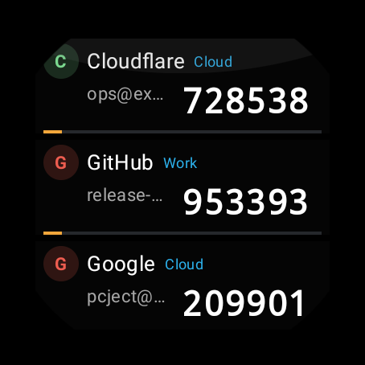
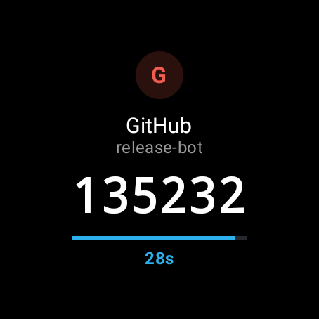
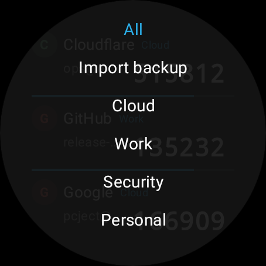
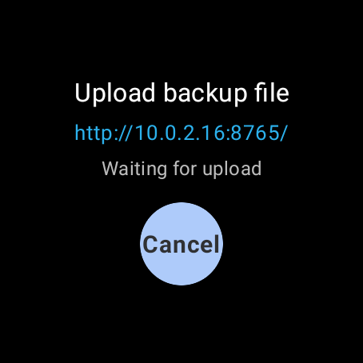

# WristOTP

English | [简体中文](README.zh-CN.md)

WristOTP is a standalone native Wear OS authenticator app for watches.

It is designed for watches that may not have Google Mobile Services, Play Services, phone-node sync, external storage access, or a usable system file picker. Authenticators are stored locally on the watch, and backups are imported through a temporary HTTP upload page that can be opened from a phone browser on the same LAN.

## Screenshots

The screenshots below use generated demo authenticator data.

<p>
  
  
</p>
<p>
  
  
</p>

## Features

- Standalone Wear OS APK
- No Google Play Services, Wearable API, phone companion app, or cloud sync
- TOTP codes shown directly in the watch list
- Horizontal countdown progress bar for each TOTP row
- Detail screen with larger code and countdown
- Top drawer with `All`, `Import backup`, and backup categories
- Long-press drag reorder on the list
- App-private storage under `context.filesDir`
- Temporary on-watch HTTP upload server for backup import
- English and Simplified Chinese strings

## Supported OTP Data

- `otpauth://totp/...`
- SHA1, SHA256, and SHA512
- 6-digit and 8-digit codes
- Configurable TOTP period, defaulting to 30 seconds
- Base32 secrets with tolerant casing, whitespace, hyphen, and padding handling
- HOTP metadata import is retained, but dynamic HOTP generation is intentionally not implemented yet

## Backup Import

Open `Import backup` on the watch. WristOTP starts a temporary HTTP server on port `8765` and shows a local URL such as:

```text
http://192.168.x.x:8765/
```

Open that URL from a phone browser on the same LAN, choose the backup file, and enter the backup password if the file is encrypted. The server runs only while the import screen is open.

Supported inputs:

- `.txt`: one `otpauth://` URI per line
- `.html` / `.htm`: HTML backup with OTP URIs in code/link/text content
- `.stratum` or unknown extension: Stratum-compatible backup JSON, strong encrypted backup, or legacy encrypted backup

Stratum compatibility is implemented from the public backup format. This repository does not vendor or copy the Stratum source tree.

## Storage

Runtime data is stored in the app-private internal files directory:

```text
context.filesDir/
  authenticators.json
  categories.json
  preferences.json
  icons/<icon-id>
```

The first version stores OTP secrets as plaintext JSON in the app-private directory. Android app sandboxing protects this from normal cross-app access, but it is not an additional encryption layer. Clearing app cache should not remove authenticators; clearing app data will remove them.

## Build

Requirements:

- JDK 17
- Android SDK with API 36 platform and matching build tools
- Network access to Maven repositories used by Gradle

Build a debug APK:

```bash
./gradlew :app:assembleDebug
```

Run core tests:

```bash
./gradlew :core:test
```

Build an unsigned release APK:

```bash
./gradlew :app:assembleRelease
```

Signing keys, local SDKs, APKs, and other generated release artifacts are intentionally not committed.

## Project Layout

```text
app/   Wear OS Android app and UI
core/  OTP generation, backup parsing, crypto, HTTP import, and storage
```

## License

This project is released under the MIT License. See [LICENSE](LICENSE).
